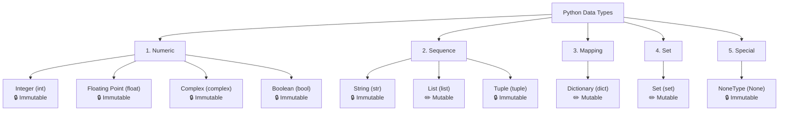

# Python Data Types, Variables & Memory Management
*A Comprehensive Guide tailored for CBSE Class 11 (Computer Science & Informatics Practices) and Advanced Python Understanding.*

---

## 1. Python Core Data Types (CBSE Class 11 Syllabus)

In Python, every value has a datatype. In Class 11, a major focus is not just knowing the data types, but understanding whether they are **Mutable** (can be changed after creation in memory) or **Immutable** (cannot be changed after creation in memory).

---

### A. Hierarchical Tree Representation

In CBSE Computer Science and Informatics Practices, Python data types are best understood as a hierarchy branching from core categories down to specific types:



#### Quick Outline View:
* **1. Numeric Types** *(All Immutable 🔒)*
  * `int` (Integers: whole numbers)
  * `float` (Floating-point: decimal numbers)
  * `complex` (Complex numbers: real + imaginary `j`)
  * `bool` (Booleans: `True` or `False`)
* **2. Sequence Types** *(Ordered collections)*
  * `str` (String: character sequences) — *Immutable 🔒*
  * `list` (List: `[item1, item2]`) — **Mutable ✏️**
  * `tuple` (Tuple: `(item1, item2)`) — *Immutable 🔒*
* **3. Mapping Types** *(Key-Value collections)*
  * `dict` (Dictionary: `{key: value}`) — **Mutable ✏️**
* **4. Set Types** *(Unordered unique collections)*
  * `set` (Set: `{item1, item2}`) — **Mutable ✏️**
* **5. Special Types**
  * `None` (NoneType: null/absence of value) — *Immutable 🔒*

---

### B. ASCII Box Tabular Form (Fixed-Width Grid)

*(Note: Formatted as an ASCII grid diagram, matching the memory architecture style in Section 6!)*

```
+-----------+----------------------+-------------+----------------------------------------------+
| Category  | Data Type (Keyword)  | Mutability  | Description & Example                        |
+-----------+----------------------+-------------+----------------------------------------------+
| Numeric   | Integer (int)        | IMMUTABLE   | Whole numbers without decimals.              |
|           |                      |             | Ex: age = 16, temp = -5                      |
+-----------+----------------------+-------------+----------------------------------------------+
| Numeric   | Floating Point       | IMMUTABLE   | Real numbers containing a decimal point.     |
|           | (float)              |             | Ex: pi = 3.1415, marks = 95.5                |
+-----------+----------------------+-------------+----------------------------------------------+
| Numeric   | Complex (complex)    | IMMUTABLE   | Real and imaginary part (suffix j).          |
|           |                      |             | Ex: z = 3 + 4j                               |
+-----------+----------------------+-------------+----------------------------------------------+
| Numeric   | Boolean (bool)       | IMMUTABLE   | Logical truth values: True or False.         |
|           |                      |             | Ex: is_passed = True                         |
+-----------+----------------------+-------------+----------------------------------------------+
| Sequence  | String (str)         | IMMUTABLE   | Ordered collection of characters.            |
|           |                      |             | Ex: name = "Amit", char = 'A'                |
+-----------+----------------------+-------------+----------------------------------------------+
| Sequence  | List (list)          | MUTABLE     | Ordered collection in square brackets [].    |
|           |                      |             | Ex: vowels = ['a', 'e'], data = [1, "Hi"]    |
+-----------+----------------------+-------------+----------------------------------------------+
| Sequence  | Tuple (tuple)        | IMMUTABLE   | Ordered collection in parentheses ().        |
|           |                      |             | Ex: coords = (10, 20)                        |
+-----------+----------------------+-------------+----------------------------------------------+
| Mapping   | Dictionary (dict)    | MUTABLE     | Key-Value pairs in curly braces {}.          |
|           |                      |             | Ex: student = {"name": "Riya", "age": 16}    |
+-----------+----------------------+-------------+----------------------------------------------+
| Set       | Set (set)            | MUTABLE     | Unordered unique items in braces {}.         |
|           |                      |             | Ex: unique_ids = {101, 102, 103}             |
+-----------+----------------------+-------------+----------------------------------------------+
| Special   | NoneType (None)      | IMMUTABLE   | Represents absence of value / null.          |
|           |                      |             | Ex: result = None                            |
+-----------+----------------------+-------------+----------------------------------------------+
```

---

### Key Takeaways for CBSE Exams

> [!IMPORTANT]
> **The Golden Rule of Mutability**
> Always remember that **Lists, Dictionaries, and Sets are Mutable**. Almost everything else (**Integers, Floats, Strings, Tuples, Booleans**) is **Immutable**. 
> *This is a guaranteed 1-mark or 2-mark question in CBSE board exams!*

* **Sequences vs. Mappings:**
  * **Sequences (`str`, `list`, `tuple`):** Store data in a specific, indexed order (starting from index `0`). You can slice and index them sequentially.
  * **Mappings (`dict`):** Map unique keys to specific values, rather than using sequential positional indexes.

* **Why are there no `char` or `double` types in Python?**
  * Because Python is the primary language in the CBSE Class 11 syllabus, students transitioning from C++, Java, or SQL often look for `char` or `double`. Python simplifies data types by removing these distinctions!

---

## 2. Python Operator Precedence Order

When an expression contains multiple operators, Python evaluates them based on **precedence order** (highest to lowest). 
*Note: If operators have the same precedence, they evaluate from **left to right**, except for Exponentiation (`**`), which evaluates from **right to left**.*

| Precedence (Highest to Lowest) | Operator | Description | Associativity |
| :---: | :--- | :--- | :---: |
| **1** | `**` | Exponentiation (Power) | Right to Left |
| **2** | `+x`, `-x`, `~x` | Unary Plus, Unary Minus, Bitwise NOT | Left to Right |
| **3** | `*`, `/`, `//`, `%` | Multiplication, Division, Floor Division, Modulus | Left to Right |
| **4** | `+`, `-` | Addition, Subtraction | Left to Right |
| **5** | `<<`, `>>` | Bitwise Left Shift, Bitwise Right Shift | Left to Right |
| **6** | `&` | Bitwise AND | Left to Right |
| **7** | `^` | Bitwise XOR | Left to Right |
| **8** | `\|` | Bitwise OR | Left to Right |
| **9** | `==`, `!=`, `>`, `<`, `>=`, `<=`, `is`, `is not`, `in`, `not in` | Comparisons, Identity, and Membership | Left to Right |
| **10** | `not` | Logical NOT | Left to Right |
| **11** | `and` | Logical AND | Left to Right |
| **12** | `or` | Logical OR | Left to Right |

---

## 3. Memory Size and Range of Python Data Types

Unlike languages like C or Java where variables have fixed memory allocations (e.g., 4 bytes for an integer), **Python manages memory dynamically**.

| Data Type | Approximate Memory Size | Range / Precision Limits |
| :--- | :--- | :--- |
| **Integer (`int`)** | Variable (Starts at 24 or 28 bytes) | **Unlimited.** Grows dynamically based on the number's magnitude. Limited only by system RAM! |
| **Float (`float`)** | 8 bytes (64-bit) | $\pm 2.22 \times 10^{-308}$ to $\pm 1.79 \times 10^{308}$. Accurate up to **~15 decimal places**. |
| **Boolean (`bool`)** | 24 to 28 bytes | Only two values: `True` (acts as `1`) or `False` (acts as `0`). |
| **Complex (`complex`)** | 16 bytes | Contains two 64-bit floats (8 bytes for real part + 8 bytes for imaginary part). |

---

## 4. Why Python Has No `char` or `double`

### A. Difference Between String and Char

In traditional programming languages (and SQL), characters and strings are strictly separate types. In Python, this distinction does not exist.

| Feature | `char` (C++ / Java / SQL) | `str` / String (Python) |
| :--- | :--- | :--- |
| **Definition** | A single character (e.g., `'A'`, `'7'`, `'$'`). | A sequence of characters of any length. |
| **Python Support** | **Does not exist.** | Python uses strings for everything. |
| **How Python Handles It** | N/A | A single character is simply treated as a **string of length 1**. |
| **Quotes Required** | Strictly single quotes (`'a'`). | Single, double, or triple quotes (`'a'`, `"a"`, `"""a"""`). |
| **Memory Allocation** | Fixed (Usually 1 byte in C++ or 2 bytes in Java). | Variable, depending on the length of the string. |

### B. Difference Between Float and Double

C++ and Java split decimal numbers into two categories based on memory size and precision. Python merges them into a single high-precision type.

| Feature | `float` (C++ / Java) | `double` (C++ / Java) | Python's `float` |
| :--- | :--- | :--- | :--- |
| **Precision Type** | Single Precision (32-bit) | Double Precision (64-bit) | **Double Precision (64-bit)** |
| **Python Support** | N/A | **The keyword `double` does not exist.** | Python's `float` is actually a C-style `double` under the hood! |
| **Decimal Accuracy** | ~7 decimal places | ~15 decimal places | **~15 decimal places** |
| **When to Use?** | Used to save memory in large arrays in C++/Java. | Default for highly precise decimal math. | Default for all decimal math in Python. |

---

## 5. Behind the Scenes: Why Python is "Memory-Heavy" & How It Optimizes

> [!NOTE]
> **Why does an integer take 28 bytes in Python instead of 4 bytes like in C++?**
> Because in Python, **everything is an Object**. There are no "primitive" data types!

In C++, an integer is just raw binary data taking up exactly 4 bytes. In Python (CPython), an integer takes up **28 bytes** (on a 64-bit system) because every number is a fully fleshed-out **Object** in memory. Those 28 bytes store:
1. **The Actual Value:** The numeric digit(s).
2. **The Reference Count:** Used by the Garbage Collector to track how many variables point to this object.
3. **The Type Identifier:** A pointer to the type object (so Python knows it is an `int` and not a `float`).

### The Trade-Off: Developer Ease vs. Memory Efficiency
Python intentionally sacrifices memory efficiency for **developer productivity**. By making everything a dynamic object and automating memory allocation/destruction, Python allows developers to write code faster without worrying about declaring variable sizes, handling manual memory leaks, or dealing with integer overflow errors.

---

### Python's Clever Memory Optimizations

To stop your computer's RAM from filling up due to heavy object sizes and immutability, Python uses brilliant behind-the-scenes optimizations:

#### 1. Reference Counting & The Garbage Collector
When you reassign an immutable variable (e.g., `x = 1`, then `x = 2`, then `x = 3`), what happens to the old numbers? They don't just sit in memory forever!
* Python keeps a strict tally (**reference count**) of how many variable names point to a specific object in memory.
* When you change `x` from `10` to `15`, the reference count for the object `10` drops by `1`.
* If an object's reference count hits **zero** (no variables pointing to it), Python's **Garbage Collector** immediately destroys it and reclaims that RAM space.

#### 2. Integer Caching (The Array of Small Integers)
To save memory and speed up execution, CPython pre-loads an array of commonly used integers the moment you start the Python interpreter.
* **All integers from `-5` to `256` are created and cached in memory before you even write a line of code.**
* Because integers are immutable, Python doesn't create a new object in memory every time you type `10` or `100`. It simply points your variable to the pre-existing cached object!

```python
# PROVING INTEGER CACHING WITH id() FUNCTION

x = 10
y = 10
# Because 10 is inside the cache (-5 to 256), Python reuses the exact same object in memory!
print(id(x) == id(y))  # Output: True

a = 300
b = 300
# Because 300 is outside the cache, Python is forced to create two separate objects in memory!
print(id(a) == id(b))  # Output: False
```

---

## 6. Python Memory Architecture: Stack vs. Heap

To truly master how variables and functions work in Python, you must understand how Python divides computer memory into the **Stack** and the **Heap**.

### A. Correction: How Java Actually Uses Memory
Students often confuse Java's memory model with Python's. In Java:
* **The Stack:** Stores primitive data values (`int`, `double`, `boolean`) directly. It **also stores references** (memory addresses/pointers) for complex objects.
* **The Heap:** Stores the **actual complex objects** (like `new ArrayList()` or custom class instances).

### B. How Python Uses Memory
Because **everything in Python is an object** (there are no primitive types), Python relies heavily on the Heap!

| Memory Area | What Python Stores Here |
| :--- | :--- |
| **The Call Stack** | Stores **variable names (labels/identifiers)** and **references (pointers)** to objects. It also manages function execution frames (remembering which function called which and local variables). |
| **The Private Heap** | Stores **ALL actual objects and values**. Whether it is a massive custom class object, a list of a million numbers, or just the simple integer `5`, the actual data lives on the Heap! |

---

### A Real Python Memory Example

Let’s trace what happens in your computer's memory when you execute these two lines of code:

```python
age = 16
name = "Amit"
```

1. **On the Private Heap:**
   * Python's memory manager allocates space on the Heap and creates an **Integer Object** containing `16`.
   * It allocates another space on the Heap and creates a **String Object** containing `"Amit"`.
2. **On the Call Stack:**
   * Python creates the variable names (labels) `age` and `name` inside the current execution stack frame.
3. **The Connection (References):**
   * Python links (points) the label `age` on the Stack to the memory address of object `16` on the Heap.
   * Python links (points) the label `name` on the Stack to the memory address of object `"Amit"` on the Heap.

```
       CALL STACK                      PRIVATE HEAP
+-----------------------+         +---------------------------+
|  Variable Names       |         |  Actual Objects (Data)    |
|                       |         |                           |
|   age  -------------->|-------->|   [int object: 16]        |
|                       |         |                           |
|   name -------------->|-------->|   [str object: "Amit"]    |
+-----------------------+         +---------------------------+
```

> [!TIP]
> **The Big Takeaway**
> In languages like C++ or Java, simple numbers are lightweight enough to be thrown directly onto the Stack. 
> In Python, because every number is a full-blown object (taking ~28 bytes with reference counts and type IDs), it is too complex for the Stack. **Python puts ALL values on the Heap** and uses the **Stack only to store the variable labels pointing to those Heap objects!**
